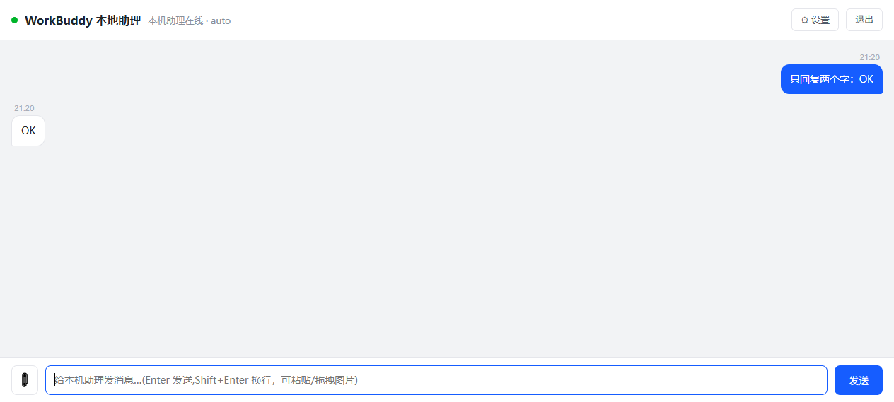

# WorkBuddy Web（本机网页助理）

> ⚠️ **非官方项目（Unofficial）**。本工具把**本机已安装的 WorkBuddy 助理**包装成一个网页聊天界面，属于本地桥接 / 网页壳，**不是**官方的 server 版、私有化部署或 Docker 镜像。与 WorkBuddy 官方无隶属关系。

在浏览器里跟本机 WorkBuddy 助理对话：发文字、粘贴/拖拽截图、实时看思考过程、随时停止。



## 原理

```
浏览器网页(8790) → 本地桥接(server.js) → 本机 WorkBuddy 客户端(CLI) → WorkBuddy 云端模型
```

- **"本地直连"指的是通道**：直连本机 WorkBuddy 客户端，不需要开放平台授权，也不用 client_id。
- **模型本身在云端**（WorkBuddy 提供），可在设置页选择 HY4 / GLM / DeepSeek / Kimi 等；选「自动」则跟随桌面 App 当前所选。

## 依赖（重要）

- **必须**：目标电脑已安装 **WorkBuddy 桌面客户端**——本工具通过它的 `codebuddy` CLI 工作，没装则无法启动。
- **Node.js 18+**：默认使用随包自带的便携版 `runtime\node\node.exe`。若你的仓库未包含 `runtime/`（体积原因），请自备 Node 并修改 `start.bat` 里的 `NODE` 路径。

## 快速开始

1. 复制 `config.example.json` 为 `config.json`，把 `access_password` 改成你自己的密码（示例里是占位值）。
2. 双击 `start.bat`（或执行 `node server.js`）。
3. 浏览器打开 `http://localhost:8790`，输入访问密码即可。

## 端口

| 端口 | 用途 | 暴露范围 |
|---|---|---|
| 8790 | 网页 + HTTP 服务 | 0.0.0.0（局域网可访问） |
| 8793 | 本机 CLI 网关，启动时自动拉起 | 仅 127.0.0.1 |

## 功能

- 网页聊天，逐字流式回复
- 粘贴 / 拖拽 / 上传截图，图文可一起发送
- 实时显示模型思考过程（💭 可折叠）
- 生成过程中可点「■ 停止」中断，并释放后端
- 全局互斥：上一条没回完时再发会被提示「正忙」，避免多个 CLI 互相打架

## 安全提示

- `config.json`、`settings.json`、`token.json`、`*.log` 均**不入库**（见 `.gitignore`）——它们含访问密码与网关密钥。
- 默认仅供**本机 / 局域网**使用。若要暴露到公网，请自行加 HTTPS、鉴权与访问控制。

## 致谢

原始版本由 **77** 开发；本仓库在其基础上补充了网页桥接、截图发送与流式思考显示。
